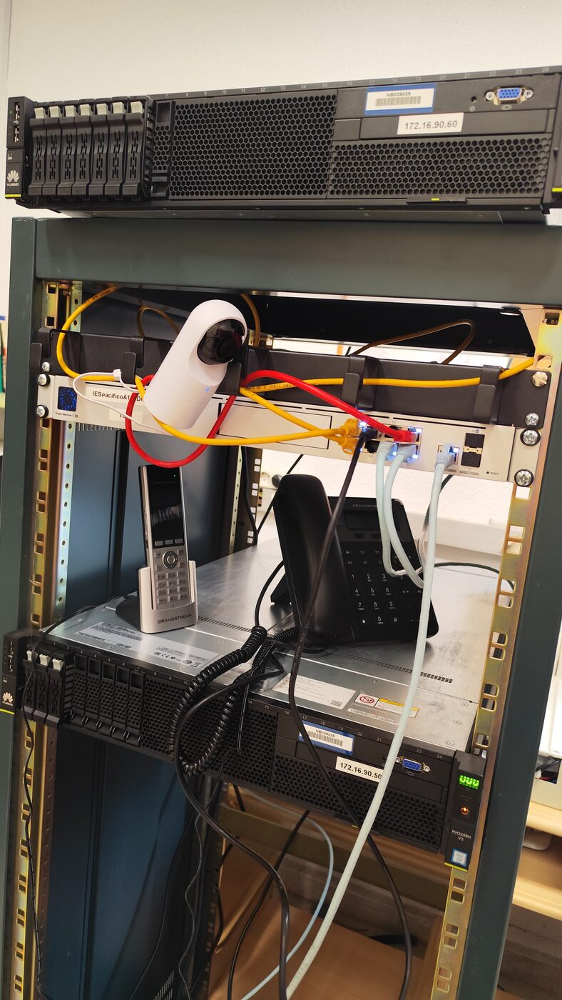
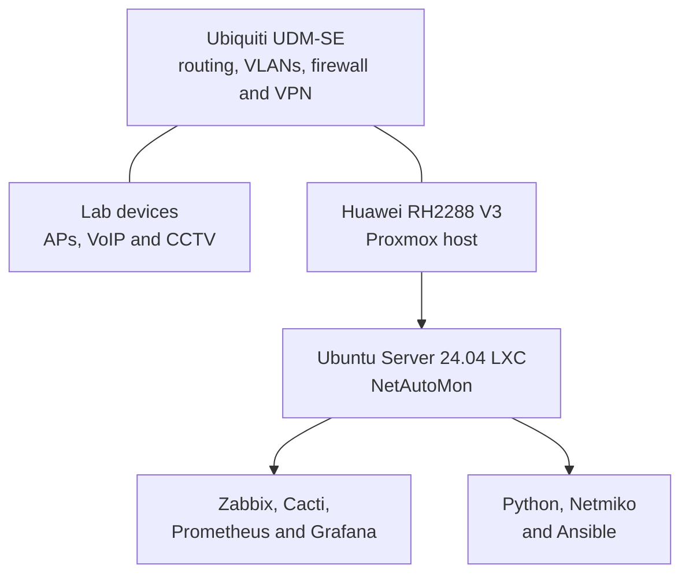
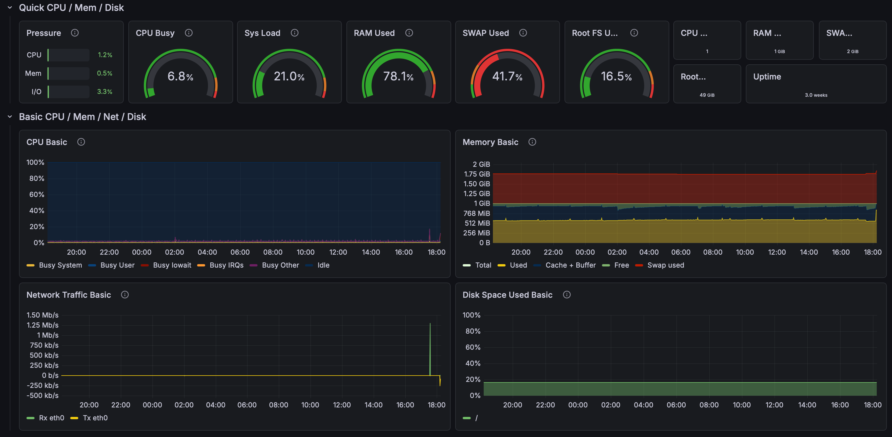
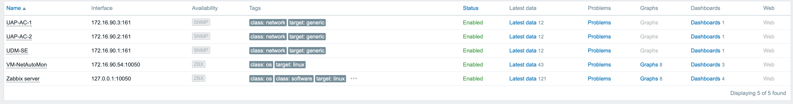
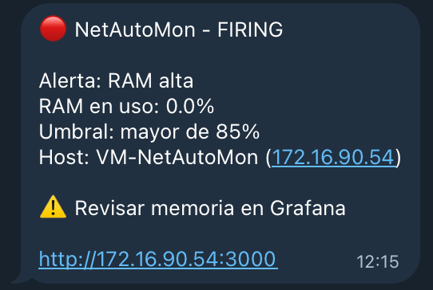
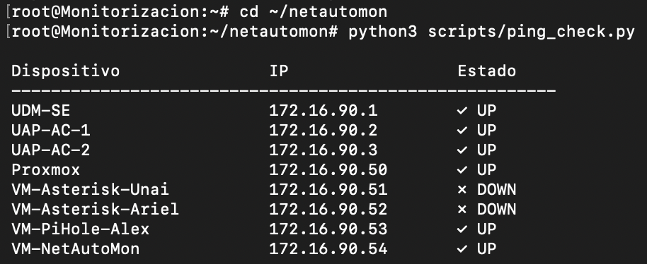
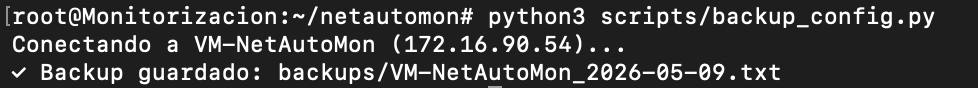
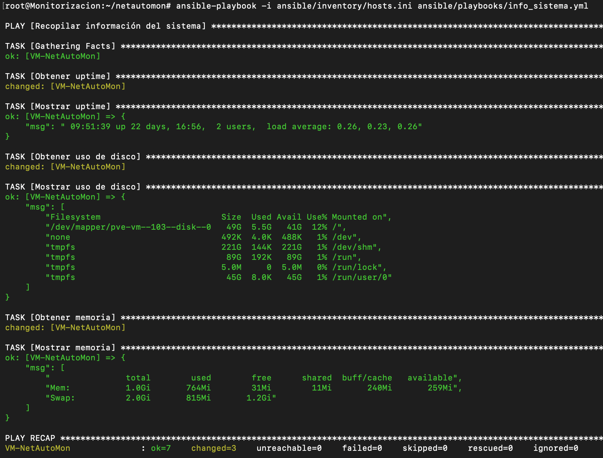

# NetAutoMon

**Network monitoring, Linux administration and small-scale automation in a physical training lab**


NetAutoMon was my final project for the Higher Degree in Telecommunications and Computer Systems at IES Pacífico in Madrid. It was also the first project where I had enough freedom to decide what kind of engineer I wanted to become.

I did not begin with a list of tools that I wanted to place on my CV. I began with a problem that bothered me: infrastructure work can become repetitive very quickly, configuration can be lost, and a service may fail quietly until somebody notices. Checking every device and service by hand did not feel like a good answer. Restarting everything whenever something behaved strangely did not feel like one either.

During my traineeship at the Museo Nacional Thyssen-Bornemisza, I worked closely with an experienced systems technician who taught me to investigate before applying a quick fix. We looked at symptoms, connectivity, system state, configuration and logs, formed a possible explanation and then tested it. I was still a student and often did not know the solution, but I learned that not knowing the answer is different from not knowing how to look for it. That way of thinking followed me into this project.

Networking was already my strongest area because of my studies, labs and CCNA. Linux and Python were much newer to me. NetAutoMon gave me a reason to use all three together. A host could be reachable while its application was down; monitoring could detect that failure, but somebody still needed a safe response. I wanted to understand those connections.

The result ran in a physical training lab with a Ubiquiti router, access points, a Huawei rack server, VoIP phones and a CCTV camera. It was not a production deployment, and I do not present it as one. My aim was to build something I could explain, deliberately break parts of it, observe what happened and work out how to recover them.

## What I wanted to find out

I treated the project as a set of practical questions rather than a checklist of technologies:

- Could I get a useful view of the network without checking every device separately?
- Could I tell the difference between a host being unreachable, a service being stopped and a server running out of resources?
- Could I preserve enough information to understand how a Linux host was configured?
- Could I turn repeated terminal work into small scripts and playbooks that I still understood?
- If I intentionally caused a failure, could I detect it, recover the service and prove that it was healthy again?

Some answers were incomplete. NetAutoMon became a working lab, but not a production platform or an autonomous recovery system. Its gaps showed me what Git does not back up, how much application state remained manual and what I would need to build next.

In its current form, it can:

- check whether the devices in a YAML inventory respond to ICMP;
- collect Linux network state over SSH and save dated snapshots;
- inspect system, network and resource information with Ansible;
- check seven services and start any that are down when the recovery playbook is run;
- monitor Linux hosts and network devices through agents, SNMP and exporters;
- display current and historical metrics; and
- send Grafana alerts to Telegram.

## The lab



*The physical classroom lab used for the project. NetAutoMon ran on the lower Huawei RH2288 V3 server shown in the rack.*

The Ubiquiti UDM-SE was the central router, switch, firewall and controller for Wi-Fi, CCTV and the WireGuard VPN. VLANs separated the lab services. A Huawei RH2288 V3 ran Proxmox, and NetAutoMon lived in an Ubuntu Server 24.04 LXC container with 4 GB of RAM and 49 GB of storage.

I administered the Ubuntu container and the applications inside it. I used the Proxmox web interface and understood where the container ran, but I did not administer the Proxmox host in depth.



WireGuard gave me remote access to the lab. From the NetAutoMon container, the monitoring tools used agents or SNMP, while the Python scripts and Ansible connected to Linux hosts through SSH.

The physical layout, addressing, VLAN roles, service placement and communication paths will be documented in [Architecture](docs/architecture.md).

## Why four monitoring tools?

I did not add four tools to claim that I had mastered all of them. I wanted to compare different approaches and understand where each one was useful.

| Tool | What I used it for |
| --- | --- |
| **Zabbix 7.0** | Main availability and alerting platform. The NetAutoMon host exposed 43 agent metrics; the UDM-SE and two access points each exposed 12 SNMP metrics. |
| **Cacti** | Historical traffic graphs for 21 selected UDM-SE interfaces, including physical ports, VLAN interfaces and the WireGuard tunnel. Polling ran every five minutes. |
| **Prometheus + Node Exporter** | Linux metrics collected every 15 seconds. |
| **Grafana** | Current CPU, RAM, disk, network, IOPS and uptime views using the Node Exporter Full dashboard, plus alert delivery to Telegram. |

### Current metrics in Grafana



### Hosts and SNMP monitoring in Zabbix



### Telegram alert test



*This screenshot came from Grafana's manual **Test** action for the Telegram contact point. That is why the message shows `RAM 0.0%` even though the rule says `> 85%`: it is a test payload, not a real RAM threshold breach. The actual rule was configured to evaluate RAM usage every minute.*

Getting the Telegram message working was not completely smooth. My first templates returned HTTP 400 errors because of formatting, emojis and special characters. I simplified the message to plain text and tested the contact point again.

That problem represented much of the project. When an integration failed, I reduced it to the simplest version that worked, confirmed the complete path and only then added complexity again.

The monitoring choices, collected metrics, SNMP setup, alert rule and screenshots will be explained in [Monitoring](docs/monitoring.md).

## Automation I wrote

The automation is deliberately small. I preferred scripts and playbooks that I could explain and troubleshoot over a larger framework that hid what was happening.

I was not trying to replace administrators with one enormous script. When I repeated the same checks, I wanted to understand the steps and make them reproducible. If automation failed, I still wanted to know what it had run and where to investigate.

### Python and Netmiko

[`ping_check.py`](scripts/ping_check.py) reads [`inventory/hosts.yml`](inventory/hosts.yml), sends one ICMP request to each device and prints a simple UP/DOWN table.



[`backup_config.py`](scripts/backup_config.py) connects to Linux hosts through SSH with Netmiko and records:

- `ip addr show`
- `ip route show`
- `/etc/hosts`

The output is stored as a dated text file under `backups/`. This is a snapshot of Linux network state, not a complete system backup and not yet a backup of the UDM-SE configuration.



### Ansible

The playbooks cover tasks I had previously performed one host at a time:

- [`info_sistema.yml`](ansible/playbooks/info_sistema.yml): uptime, memory and disk information;
- [`info_red.yml`](ansible/playbooks/info_red.yml): interfaces, routes and listening/active connections;
- [`check_recursos.yml`](ansible/playbooks/check_recursos.yml): CPU, RAM, disk and uptime with simple thresholds and a local report;
- [`actualizar_sistema.yml`](ansible/playbooks/actualizar_sistema.yml): package cache update, upgrade and autoremove; and
- [`check_servicios.yml`](ansible/playbooks/check_servicios.yml): state checks for seven services and startup of any service found inactive.



The scripts, inventories, playbooks, expected output and safety considerations will be covered in [Automation](docs/automation.md).

## Failure and recovery test

For one demonstration, I tested the handoff between Zabbix and Ansible. It was not a self-healing workflow: I still started the playbook myself.

1. I deliberately stopped `grafana-server`.
2. Zabbix detected that Grafana was unavailable in under a minute.
3. I manually ran `check_servicios.yml`.
4. The playbook found the inactive service and started it.
5. Zabbix then confirmed that the service was available again.

```bash
sudo systemctl stop grafana-server
ansible-playbook -i ansible/inventory/hosts.ini \
  ansible/playbooks/check_servicios.yml
```

The recovery action inside the playbook is automated; triggering the playbook is manual. Connecting the alert to a carefully controlled automation runner would be a later step, not something this version already does.

I enjoyed this part because it showed a complete incident rather than a healthy dashboard. Breaking Grafana was not a side effect of the demo; it was how I tested whether detection, recovery and validation actually worked together.

## What happened when the storage failed

During development, the project containers were lost after a failure in the Proxmox host's RAID storage. My teacher told me that overheating had damaged the disks; I did not diagnose the hardware failure myself. Proxmox had to be reinstalled and the containers had to be recreated.

GitHub did not restore the whole environment. It gave me back the parts I had actually versioned: the Python scripts, Ansible playbooks, inventory structure and documentation. The Zabbix and Cacti databases, Grafana configuration, dashboards and monitoring history lived inside the lost container and were not recoverable from the repository.

Rebuilding the environment made the limitation obvious. Installing every package again took too long, so I later wrote [`setup.sh`](setup.sh) to bootstrap the base dependencies and monitoring services on a clean Ubuntu system. It reduces repetitive installation work, but it is not yet a complete disaster-recovery solution: dashboards, monitored hosts, alert rules and all application data still need a proper backup and restore process.

The lesson was simple: Git gave me back the files, but not the system. Code versioning and system backups solve different problems.

I did not want to finish by saying, “I can reinstall it manually next time.” Rebuilding exposed the slow, forgettable steps, so I converted part of them into `setup.sh`. It is limited, but it came from a problem I had experienced: do the work, understand where it hurts and automate what is repeatable.

The simulated outage, evidence, recovery steps, real storage failure and post-incident lessons will be documented in [Failure and Recovery](docs/failure-recovery.md).

## Running the code

This repository documents the original lab and still contains lab-specific addresses and inventory examples. Review and replace them before running anything in another environment. Use SSH keys or Ansible Vault for authentication rather than putting passwords in inventory files.

### Python scripts

The scripts require Python 3.10 or newer and the packages in [`requirements.txt`](requirements.txt).

```bash
git clone https://github.com/nicolas-vico/netautomon.git
cd netautomon

python3 -m venv .venv
source .venv/bin/activate
pip install -r requirements.txt

python3 scripts/ping_check.py
python3 scripts/backup_config.py
```

Before running them, adapt `inventory/hosts.yml` to your environment. The backup script currently supports Linux hosts that accept SSH connections.

### Ansible playbooks

Adapt `ansible/inventory/hosts.ini`, confirm connectivity and then run only the playbook you need. Some playbooks update packages or start services, so they should not be launched blindly.

```bash
ansible all -i ansible/inventory/hosts.ini -m ping

ansible-playbook -i ansible/inventory/hosts.ini \
  ansible/playbooks/info_sistema.yml

ansible-playbook -i ansible/inventory/hosts.ini \
  ansible/playbooks/check_recursos.yml
```

### Bootstrap script

`setup.sh` was written for a clean Ubuntu 22.04/24.04 lab host. It updates the operating system, installs packages and configures several services and a local database. Read it before use and do not treat it as a production installer.

```bash
sudo bash setup.sh
```

## What it does not do yet

- it was built and tested in a training network, not at production scale;
- the service-recovery playbook is launched by an operator;
- the Python backup records Linux network state, not full device or application configuration;
- monitoring databases, dashboards and alert definitions are not yet exported as code;
- the bootstrap script is lab-oriented and needs stronger secret handling and idempotency; and
- there are no automated tests yet.

If I continue the project, I would first remove the remaining lab-specific authentication, move secrets to SSH keys or Vault and export the monitoring configuration. After that, I would build and test a proper restore procedure before connecting selected alerts to controlled remediation jobs. Prometheus SNMP Exporter would also let me put the router and Linux metrics in the same Grafana view.

## What I learned

NetAutoMon was my first project where networking, Linux and automation all depended on each other. I learned to check what is actually happening: which host is reachable, which service is running, what the metrics show, what has really been backed up, and what still exists only inside a server.

It also gave me a clear list of gaps to work on next. I have hands-on Linux experience and basic Python knowledge; I am more comfortable with Linux than Python, and I am actively improving both.

## Author

**Nicolás Noé Vico Lobato**<br>
CCNA · Telecommunications and Computer Systems (EQF Level 5)<br>
Based in Zürich, Switzerland

[LinkedIn](https://www.linkedin.com/in/nicolas-vico/) · [GitHub](https://github.com/nicolas-vico)

## License

Released under the [MIT License](LICENSE).
