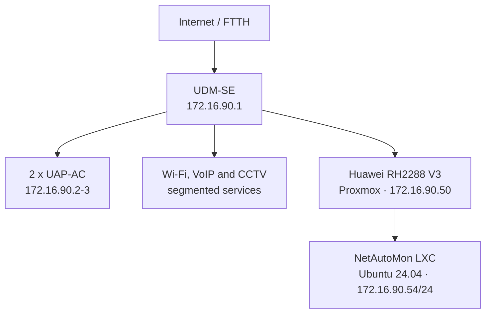
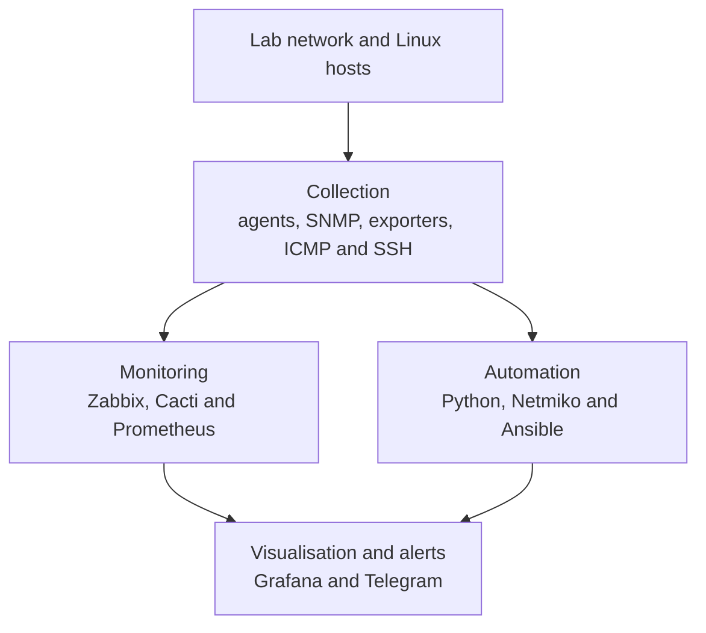

# NetAutoMon architecture

[Back to the main README](../README.md)

NetAutoMon ran in a physical training lab at IES Pacífico. The lab provided real network equipment and working Wi-Fi, VoIP and CCTV services, but it was isolated from the school's production network. This distinction matters: I could test monitoring and automation against real devices without presenting the result as a production deployment.

The architecture was built around two central components. A Ubiquiti UniFi Dream Machine SE handled routing, switching, firewalling, the wireless controller and remote VPN access. A Huawei RH2288 V3 server ran Proxmox and hosted the LXC containers used by the different student projects. NetAutoMon was one of those containers.

I administered the NetAutoMon Ubuntu container and the applications installed inside it. I used the Proxmox interface and understood how the container fitted into the host, but I did not administer the physical Proxmox platform in depth. The UDM-SE and the rest of the lab infrastructure were shared training resources rather than equipment for which I had full production ownership.

## Physical layout

*The classroom rack used for the project. It contained the Ubiquiti equipment, Huawei servers, structured cabling, an IP camera and VoIP devices.*

The UDM-SE was the main connection point. Its eight-port PoE switch powered or connected lab equipment, its UniFi controller managed the wireless access points, and its firewall and VLAN configuration separated the services. It also terminated the WireGuard VPN used to reach the lab remotely.

The Huawei server was shared between several projects. NetAutoMon ran in an Ubuntu Server 24.04 LXC container with 4 GB of RAM and 49 GB of storage. The monitoring tools, scripts, playbooks and their application data all lived inside that container.

## Addressing and device roles

The management and server network used `172.16.90.0/24`. The original private addresses are kept here because they make the lab easier to understand and are not publicly routable.

| Device | Address | Role in the lab |
| --- | --- | --- |
| Ubiquiti UDM-SE | `172.16.90.1` | Router, PoE switch, firewall, Wi-Fi/CCTV controller and WireGuard endpoint |
| UAP-AC-1 | `172.16.90.2` | Wireless access point |
| UAP-AC-2 | `172.16.90.3` | Wireless access point |
| Huawei RH2288 V3 | `172.16.90.50` | Physical Proxmox host |
| Asterisk container 1 | `172.16.90.51` | VoIP service used by another student project |
| Asterisk container 2 | `172.16.90.52` | VoIP service used by another student project |
| Pi-hole container | `172.16.90.53` | DNS service used by another student project |
| NetAutoMon container | `172.16.90.54` | Monitoring and automation platform |
| Ubiquiti G3 Flex | `10.0.19.x` | CCTV camera on the CCTV service network |
| Grandstream GXP1610 | `10.0.9.x` | Ethernet SIP phone |
| Grandstream WP822 | `10.0.9.x` | Wi-Fi SIP phone |

The Asterisk and Pi-hole containers appeared in the project inventory because they were useful reachability targets. They were not applications built or administered by me as part of NetAutoMon.

The lab used separate VLANs for services such as VoIP, CCTV and Wi-Fi. Interfaces including `br14`, `br18`, `br19` and `br20` were visible on the UDM-SE and were among the interfaces graphed in Cacti. I have not assigned exact service names to every bridge here because that mapping was not preserved clearly enough in the project material to defend it now.

## The NetAutoMon container

The LXC container brought the project into one place. I organised the applications into three functional groups rather than treating them as unrelated tools.

### Monitoring

- Zabbix used its agent for Linux metrics and SNMP for the UDM-SE and access points.
- Cacti polled selected UDM-SE interfaces through SNMP every five minutes and stored historical graphs.
- Prometheus collected Linux metrics from Node Exporter every 15 seconds.
- Grafana queried Prometheus to display current system metrics and evaluated the RAM alert used in the Telegram demonstration.

The four tools overlapped, but the overlap was intentional. I wanted to compare an integrated monitoring platform, long-term SNMP interface graphs and a Prometheus/Grafana workflow in the same lab. Their configuration and the reasons for each choice are covered in [Monitoring](monitoring.md).

### Automation

- `ping_check.py` sent ICMP probes to the devices defined in the YAML inventory.
- `backup_config.py` used SSH through Netmiko to collect Linux network state.
- Ansible used SSH to gather system and network information, update packages, inspect resource usage and check services.
- Git stored the scripts, playbooks, inventory structure and documentation.

These flows started from the NetAutoMon container. They did not configure every device in the diagram, and the Python backup was a network-state snapshot rather than a complete system or UDM-SE backup. The exact inputs, outputs and safety limits are documented in [Automation](automation.md).

## Communication paths

| Source | Destination | Protocol or port | Purpose |
| --- | --- | --- | --- |
| Remote administrator | UDM-SE | WireGuard | Enter the private lab network |
| Administrator | NetAutoMon | SSH/22 | Linux administration and manual automation runs |
| Zabbix | Linux agent | TCP/10050 | Host metrics and service information |
| Zabbix and Cacti | UDM-SE and access points | SNMP/UDP 161 | Network and interface metrics |
| Prometheus | Node Exporter | TCP/9100 | Linux time-series metrics |
| Grafana | Prometheus | TCP/9090 | Dashboard data source |
| Grafana | Telegram Bot API | HTTPS | Alert delivery |
| Browser through VPN | Grafana | TCP/3000 | Dashboards and alert configuration |
| Browser through VPN | Zabbix and Cacti | HTTP | Monitoring interfaces |
| Browser through VPN | Proxmox | HTTPS/8006 | Hypervisor web interface |

The management interfaces were intended to be reached from the private network or through WireGuard, not exposed directly to the public internet.

## Security boundaries and lab compromises

The first useful boundary was the WireGuard tunnel: remote access entered through the UDM-SE instead of publishing each service individually. VLANs provided separation between management, Wi-Fi, VoIP and CCTV traffic inside the lab.

There were also several compromises that would not be acceptable in a production design:

- SNMP v2c was used for the Ubiquiti devices. It was practical for the lab but does not provide the authentication and encryption available in SNMPv3.
- The original environment used password-based SSH and privileged access. A rebuilt version should use individual accounts, SSH keys, `sudo` and Ansible Vault or another secret store.
- Several web applications were served without a reverse proxy providing TLS and central authentication.
- Prometheus did not have its own authentication layer.
- Monitoring, dashboards and application databases shared the same LXC container.

The public repository contains example inventories only. Real credentials do not belong in version control.

## Failure domains

Putting the whole platform in one LXC made the first build manageable, but it also created a clear limitation. If the container or the Proxmox storage failed, monitoring, dashboards, alert evaluation and automation could disappear together. The real storage incident demonstrated exactly that: Git recovered versioned files, but it did not recover the application databases or monitoring history stored inside the lost container.

The UDM-SE and the single Proxmox host were also single points of failure. NetAutoMon had no high-availability design, no external monitoring node and no tested full-system restore. This was acceptable for a student lab, but it is important to state it because a healthy dashboard is not the same thing as a resilient monitoring system.

The simulated Grafana outage and the real storage failure are separated and analysed in [Failure and Recovery](failure-recovery.md).

## What I would change next

I would not start by adding more tools. The first architectural improvements would address the weaknesses the project already exposed:

1. rebuild the lab with individual accounts, SSH keys and encrypted variables instead of the original password-based access;
2. export dashboards, alert rules and monitoring configuration so they can be versioned;
3. back up the Zabbix and Cacti databases and test their restoration;
4. monitor NetAutoMon from a small external node so a complete container failure is still visible; and
5. separate persistent application data from the services that consume it before attempting automated remediation.

Those changes would make the same system easier to rebuild and trust. High availability, container orchestration or a larger observability stack would only make sense after the backup and restore path worked correctly.

---

[Back to the main README](../README.md) · [Monitoring](monitoring.md) · [Automation](automation.md) · [Failure and Recovery](failure-recovery.md)
