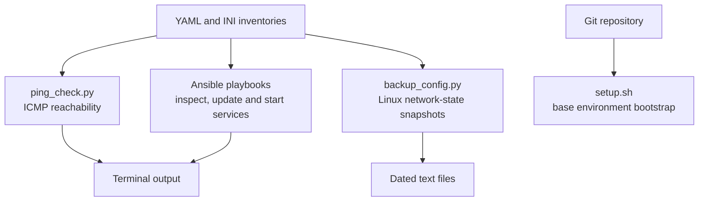
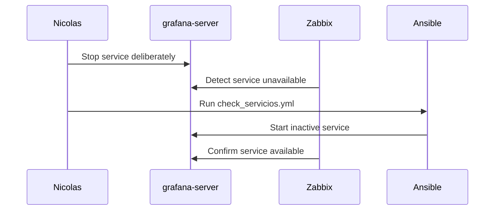

# Automation in NetAutoMon

[Back to the main README](../README.md) · [Architecture](architecture.md)

The automation in NetAutoMon started with work I was already doing manually. I was checking the same addresses, running the same Linux commands and collecting the same information more than once. Writing a small script or playbook gave me a way to make those steps repeatable without hiding them behind a system I could not explain.

This is deliberately modest automation. It does not discover and configure a network by itself, and it was not used against production infrastructure. The repository contains two Python scripts, five Ansible playbooks and one bootstrap script created for the physical training lab.

## Automation map



The operator remained in control of every action. None of these tools was triggered directly by a monitoring alert.

## Python inventory

Both Python scripts read a local `inventory/hosts.yml`, copied from the public `inventory/hosts.example.yml`. Each entry contains a device name, private IP address, type and a short list of services. The lab inventory included the UDM-SE, access points, Proxmox host, Linux containers and the NetAutoMon container.

Keeping device data outside the scripts made it easier to change the inventory without editing the program logic. The original structure was useful, but it did not have schema validation. A missing `devices`, `name` or `ip` field currently causes an exception instead of a clear validation message.

The public version uses an example inventory and external authentication. Real passwords must not be stored in YAML.

## `ping_check.py`

[`ping_check.py`](../scripts/ping_check.py) answers one narrow question: which devices in the inventory respond to one ICMP request?

For each entry it runs:

```bash
ping -c 1 -W 1 <address>
```

Standard output and error output are discarded. The return code becomes a simple `UP` or `DOWN` result in a formatted table.


This was useful as the first check, but it is not a health check. A device marked `UP` may still have a failed application, a broken route to another network or an overloaded service. A device marked `DOWN` may simply block ICMP. The script does not retry, measure latency or distinguish those cases.

The current command also assumes Linux-style `ping` options. That matched the Ubuntu container where the project ran, but it is one reason to test or adapt the command before running the script on another operating system.

Run it from the repository root with:

```bash
python3 scripts/ping_check.py
```

The script currently expects the inventory at a path relative to the working directory. A later refactor will resolve the path from the project itself or accept it as a command-line argument.

## `backup_config.py`

The name of [`backup_config.py`](../scripts/backup_config.py) is broader than its current behaviour. The script does not create a full Linux backup or export the UDM-SE configuration. It creates a text snapshot of three parts of a Linux host's network state:

```text
ip addr show
ip route show
cat /etc/hosts
```

For inventory entries marked as Linux and containing connection information, Netmiko opens an SSH session, executes the commands and stores the combined output under `backups/`.


The filename contains the device name and date. This makes the result readable, but two runs for the same device on the same day currently use the same filename and the later run overwrites the earlier one.

Another important boundary is Git. The script writes the text file; it does not execute `git add`, `git commit` or `git push`. Git can version a snapshot after the operator reviews and commits it, but that is a separate action. The original project report described this too loosely, so the repository documentation now follows what the code actually does.

Current limitations include:

- only Linux devices are selected;
- the connection expects a username from the local inventory or environment, plus an SSH key or password supplied outside Git;
- the backup directory must already exist;
- the three commands capture network state, not application or system state;
- filenames do not yet include time or a unique identifier;
- errors are printed per device, but there are no structured logs or final failure summary; and
- the UDM-SE configuration is not exported.

The public portfolio rework removed passwords from versioned inventories and supports SSH keys or authentication supplied outside Git. The next improvements would be to create the output directory explicitly, validate the inventory and produce unique files. I would keep Git commits manual until the generated content has been checked for credentials or other sensitive data.

## Ansible playbooks

The Ansible inventory defines the Linux hosts to manage over SSH. The playbooks fall into three categories: read-only inspection, system changes and service recovery.

| Playbook | What it does | Changes the remote host? |
| --- | --- | --- |
| [`info_sistema.yml`](../ansible/playbooks/info_sistema.yml) | Displays uptime, disk usage and memory | No |
| [`info_red.yml`](../ansible/playbooks/info_red.yml) | Displays interfaces, routes and active/listening connections | No |
| [`check_recursos.yml`](../ansible/playbooks/check_recursos.yml) | Calculates CPU, RAM and root-disk usage, displays thresholds and writes a local report | No intended remote change |
| [`actualizar_sistema.yml`](../ansible/playbooks/actualizar_sistema.yml) | Updates package metadata, upgrades installed packages and removes unused packages | Yes |
| [`check_servicios.yml`](../ansible/playbooks/check_servicios.yml) | Checks seven NetAutoMon services and starts any found inactive | Yes, when a service is down |


### Inspection playbooks

`info_sistema.yml` runs `uptime`, `df -h` and `free -h`. `info_red.yml` runs `ip addr show`, `ip route show` and `ss -tunap`. They gave me a repeatable first view of an unfamiliar Linux host without typing each command separately.

`check_recursos.yml` goes further by calculating CPU, RAM and disk percentages. Its thresholds are:

- CPU above 80 percent;
- RAM above 85 percent; and
- root filesystem above 80 percent.

Crossing a threshold produces a warning in the Ansible output. These messages are local playbook output, not Grafana, Zabbix or Telegram alerts. The playbook also appends a dated line to a report on the control machine.

The resource calculations use shell pipelines built from `top`, `free`, `df` and `awk`. They worked in the Ubuntu lab, but they depend on command output formats and should eventually be replaced with facts or modules where practical.

### Playbooks that change state

`actualizar_sistema.yml` runs package update, upgrade and autoremove tasks. It should never be treated like an information command. Before using it on a real environment I would need a maintenance window, package policy, rollback or recovery plan and a clear host scope.

`check_servicios.yml` checks these seven systemd units:

- `zabbix-server`;
- `zabbix-agent`;
- `prometheus`;
- `grafana-server`;
- `apache2`;
- `mysql`; and
- `cron`.

If a unit is inactive, the playbook requests `state: started` and then reports the services it changed. It does not reboot the machine and it does not restart services that are already active.

The playbook was run manually during the Grafana failure demonstration. Zabbix detected the outage, but a person still decided to execute Ansible. This distinction matters because automatic remediation needs safeguards: an allow-list, a maximum number of attempts, dependency checks, logging and a route to escalation when restarting does not fix the problem.

The current playbook uses `ignore_errors` during service checks and recovery. That kept the lab run moving, but some failed module results may not contain the same `status` fields as successful results. If I continued the project, I would add validation for that case before describing the playbook as robust.

## `setup.sh`: bootstrap after the storage incident

[`setup.sh`](../setup.sh) came after the Proxmox storage failure. Reinstalling the base packages and applications manually showed me how much time was spent repeating installation steps, so I wrote a script to bootstrap a clean Ubuntu lab host.

It performs these main actions:

1. checks for root and reports the detected Ubuntu version;
2. updates the operating system;
3. installs Git, Python, Ansible, SSH and SNMP dependencies;
4. installs Prometheus;
5. adds the Grafana repository and installs Grafana;
6. installs Zabbix 7.0, MySQL and its web components;
7. creates the Zabbix database and starts the required services;
8. installs Cacti; and
9. prepares an SSH `known_hosts` entry for the local host.

This reduced the repetitive installation work, but it was not a complete restore system. It did not restore Zabbix or Cacti databases, Grafana dashboards, alert rules, monitoring history or every application setting.

The current script is also not ready to run blindly:

- it executes as root and performs a full package upgrade;
- it prompts for a database password, but still writes that secret into the local Zabbix configuration as the application requires;
- some installation steps are not fully idempotent;
- external repositories and packages are not pinned for reproducible builds;
- there is no dry-run mode, rollback or post-installation test suite; and
- suppressing command output can hide useful diagnostic information.

For those reasons the README labels it as a lab bootstrap script, not a production installer.

## How the pieces worked together

The most complete automation demonstration used Zabbix and Ansible together without pretending they were fully integrated:



The detection was automatic. The recovery command inside the playbook was automated. The decision and trigger remained manual. [Failure and Recovery](failure-recovery.md) documents the evidence and the distinction in more detail.

## Tests I would add in a continued version

The original project did not include automated tests, and this portfolio rework preserves that boundary rather than presenting later test code as part of the lab. If I continued developing it, useful unit tests that would not require the physical environment include:

- mock ICMP results for reachable and unreachable hosts;
- validate missing or malformed inventory fields;
- mock Netmiko connections and command output;
- verify backup filenames and file contents;
- verify that connection failures do not expose credentials;
- run Ansible syntax checks;
- run Bash syntax and ShellCheck against `setup.sh`; and
- scan commits for secrets.

Real SSH, SNMP and service-recovery checks would remain optional integration tests because they need a controlled target. A unit test should not stop Grafana on whichever machine happens to run it.

## What I would improve first

My priority would be to make the existing automation safer and easier to verify rather than add another framework:

1. rebuild any future lab with individual accounts, SSH keys and encrypted variables from the beginning;
2. add input validation and explicit configuration paths;
3. create unit tests around the current Python behaviour;
4. make snapshots unique and record a clear success/failure summary;
5. make the bootstrap repeatable and verify every installed service;
6. improve Ansible error handling before linking it to an alert; and
7. test a full backup and restore of application state.

The project taught me that automation is not just replacing commands with a script. It also means deciding what the input is, what can change, how failure is reported and how somebody can recover when the automated path does not work.

---

[Back to the main README](../README.md) · [Architecture](architecture.md) · [Monitoring](monitoring.md) · [Failure and Recovery](failure-recovery.md)
