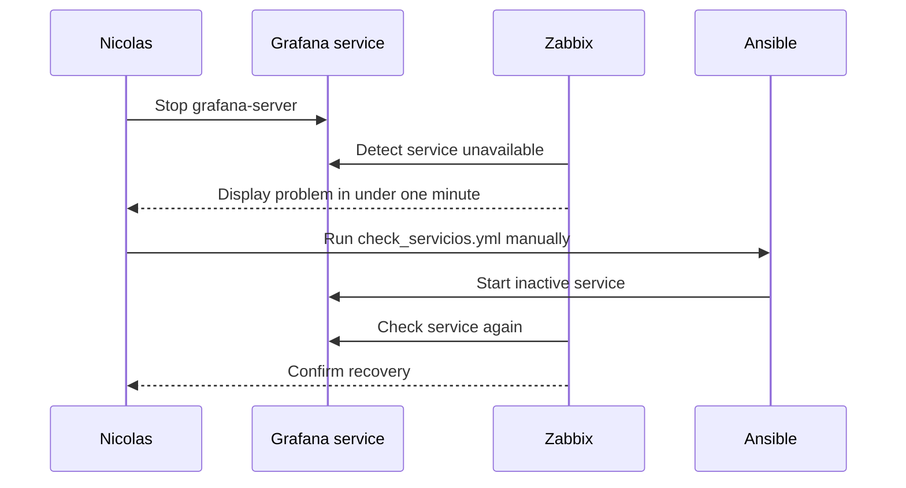
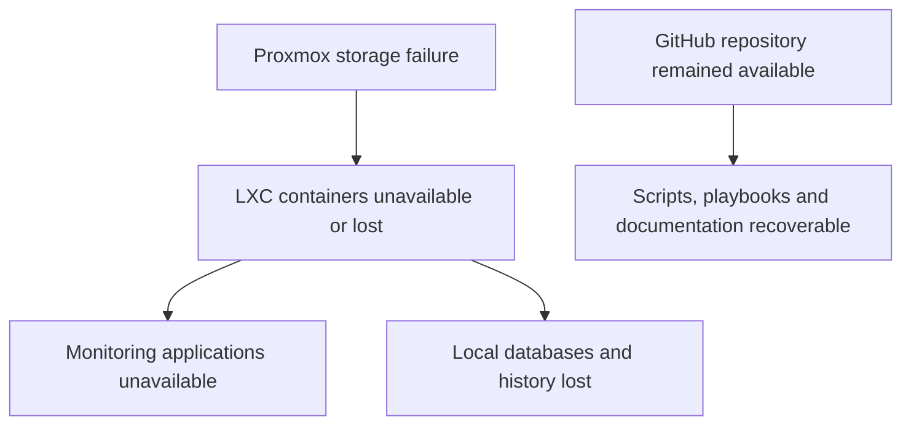

# Failure and recovery in NetAutoMon

[Back to the main README](../README.md) · [Architecture](architecture.md)

The most useful parts of NetAutoMon were not the screenshots where every device was green. They were the moments when something stopped working and I had to find out what the project could actually detect, recover and preserve.

Two different events shaped this part of the project:

1. a controlled Grafana service outage that I created to test detection and recovery; and
2. a real storage failure on the shared Proxmox host that caused the loss of the project containers.

They should not be mixed together. The first was a repeatable demonstration inside the operating system. The second was an infrastructure incident diagnosed and repaired at host level by my teacher.

## Controlled test: stopping Grafana

The aim of the controlled test was to follow a failure through more than one tool. I wanted to check whether Zabbix noticed that a service was unavailable, whether the Ansible playbook could restore it and whether the monitoring view then returned to normal.

### Test sequence

I deliberately stopped Grafana on the NetAutoMon Ubuntu container:

```bash
sudo systemctl stop grafana-server
```

The sequence was:



The recovery command was:

The command below assumes that the public example inventory has first been copied to the ignored local file `ansible/inventory/hosts.ini` and adapted to the current lab.

```bash
ansible-playbook -i ansible/inventory/hosts.ini \
  ansible/playbooks/check_servicios.yml
```

The playbook checks seven services and requests `state: started` for any service it finds inactive. In this test it found `grafana-server` stopped and started it. Zabbix then observed that the service was available again.

### What was automated

- Zabbix detected the unavailable service.
- The Ansible playbook checked the service state.
- The playbook started the inactive service.
- Zabbix detected the recovered state.

### What remained manual

- I caused the failure.
- I reviewed the Zabbix problem.
- I decided to run the playbook.
- I launched the Ansible command.

This was therefore manual remediation assisted by automation, not a self-healing system. The distinction is important because connecting an alert directly to a restart action introduces risks. A restart may hide the root cause, create a loop or make a dependent service worse.

### What the test proved

The test proved the detection-to-recovery path for one known systemd service in a controlled lab. It did not prove that:

- every possible Grafana failure would be detected;
- restarting Grafana would fix its database, configuration or data source;
- Ansible could recover an unavailable host;
- repeated restarts were safe; or
- the same playbook was ready for production.

If Grafana had failed because the disk was full, its configuration was invalid or MySQL was unavailable, starting the unit might not have solved the incident. The next step after a failed restart should be investigation and escalation, not an endless retry.

## Real incident: Proxmox storage failure

During project development, the containers on the shared Proxmox server were lost after a storage failure. My teacher told me that overheating had damaged disks in the RAID storage. I did not diagnose the physical hardware myself, and the repository does not contain controller logs, SMART data or a hardware incident report that would let me independently verify the exact failure mode.

The technically honest root-cause statement is therefore:

> The Proxmox containers were lost after a storage failure that my teacher attributed to overheating and damaged RAID disks.

It would be inaccurate to claim that I found the hardware fault or repaired the RAID.

### Impact

The failure affected more than NetAutoMon because the Huawei Proxmox host was shared by several student projects. For NetAutoMon, the container and its local state were lost. This included application configuration, databases, dashboards and monitoring history that had not been exported or backed up elsewhere.

The incident exposed the main failure domain in the architecture:



All the monitoring applications lived inside the same NetAutoMon container. The platform could monitor services while the container was running, but it could not report its own complete disappearance after the underlying storage failed.

### What GitHub recovered

The repository preserved the items that had actually been committed:

- Python scripts;
- Ansible playbooks;
- inventory structure;
- setup and dependency files; and
- project documentation.

### What GitHub did not recover

It did not contain a recoverable copy of:

- the Zabbix database;
- the Cacti database and RRD history;
- Grafana dashboards and alert configuration;
- Prometheus historical data;
- application credentials and local settings;
- the complete Ubuntu container; or
- the UDM-SE configuration.

Git therefore recovered source files, not the running platform. Calling the repository a complete backup would hide the most important lesson from the incident.

## Rebuilding the environment

My teacher reinstalled Proxmox and recreated the containers. After the NetAutoMon container was available again, I used the repository as the starting point for rebuilding the project applications and files.

The first rebuild still required a lot of manual package installation and configuration. That repetition led to [`setup.sh`](../setup.sh). The script installs the base dependencies and monitoring applications on a clean Ubuntu lab host, including Prometheus, Grafana, Zabbix, MySQL and Cacti.

This improved one part of recovery:

```text
Before: remember and repeat installation commands manually
After:  run a documented bootstrap for the base applications
```

It did not recreate the complete previous state. Databases, dashboards, alert rules, monitored hosts and historical data still needed their own export, backup and restore procedures.

The bootstrap script also needs security and repeatability improvements before it can be trusted on a new machine. Its value is that it came from a real recovery problem, not that it solved disaster recovery completely.

## Could monitoring have prevented the RAID incident?

The original project report suggested that a Telegram alert might have warned about the disk before the failure. That is a reasonable future goal, but it was not something the implemented version proved.

NetAutoMon monitored Linux resource usage and selected Ubiquiti devices. The preserved project does not show collection of:

- RAID controller health;
- SMART disk attributes;
- physical disk temperatures;
- server inlet or internal temperature;
- predictive disk errors; or
- an external heartbeat for the Proxmox host.

Without those signals, it would be wrong to say the implemented Telegram alert could have prevented the hardware incident. The configured Telegram route was tied to Grafana alerting, including the RAM rule and its contact-point test.

A temperature alert could still have helped in some overheating-related scenarios if the server exposed useful sensors and the thresholds, sampling interval and notification route had been configured before the incident. Its value would also depend on how gradually the temperature increased and whether somebody had enough time to respond. Monitoring the RAID state, SMART data and temperatures from an external node could therefore provide earlier evidence and reduce detection time, but it would not guarantee that every hardware failure could be predicted or prevented.

## Post-incident review

| Area | What happened | What I learned |
| --- | --- | --- |
| Detection | The monitoring stack was inside the failed environment | A monitor needs an external view of its own failure domain |
| Source control | GitHub preserved committed files | Version control is essential, but it is not a system backup |
| Application state | Databases and dashboards were local to the container | Stateful applications need explicit export and backup procedures |
| Recovery | Reinstallation contained repeated manual work | Repeated, understood steps are candidates for automation |
| Validation | There was no full restore test before the incident | A backup is only useful after its restoration has been tested |
| Root cause | Hardware diagnosis came from my teacher | Separate what I observed from what another person diagnosed |

I did not measure a formal recovery time objective or recovery point objective during the project. The report mentioned recovery durations, but the preserved evidence is not precise enough for me to present a verified RTO or RPO now.

## A safer recovery design

The next version should improve recovery in this order:

1. rebuild the lab with individual accounts, SSH keys and encrypted variables from the beginning;
2. export Grafana dashboards and alert definitions;
3. back up Zabbix and Cacti databases plus their required configuration;
4. record Prometheus retention decisions instead of assuming all history must be restored;
5. collect Proxmox, RAID and temperature health from an external node;
6. recreate NetAutoMon on a clean disposable host;
7. restore the application state; and
8. run controlled tests to prove that monitoring and alerts work after restoration.

Only after that would I connect selected alerts to automated remediation. The automated action would need an allow-list, limited retries, logs, verification and escalation when the service does not recover.

## Incident record template

The controlled Grafana test gave me a simple structure I can reuse for future lab incidents:

```text
Symptoms
Impact
Initial evidence
Hypotheses
Investigation
Root cause
Resolution
Validation
Prevention
```

The important part is not filling every heading with a confident answer. If the root cause is still unknown, it should stay unknown while more evidence is collected. In the storage incident, for example, I can explain what was lost and how I rebuilt my part, while being clear that the physical diagnosis belonged to my teacher.

## Final lesson

Before the storage failure, I thought having the code in Git meant the project was protected. Afterwards, I understood the missing question: protected from what?

Git protected the files I had committed. It did not protect databases, monitoring history, dashboards or the running container. `setup.sh` reduced the manual installation work, but it still did not restore the system's state.

That gap changed how I think about infrastructure. It is not enough to make a service work or even to monitor it. I need to know what can fail, where the state lives, what evidence will remain and whether the recovery procedure has actually been tested.

---

[Back to the main README](../README.md) · [Architecture](architecture.md) · [Monitoring](monitoring.md) · [Automation](automation.md)
