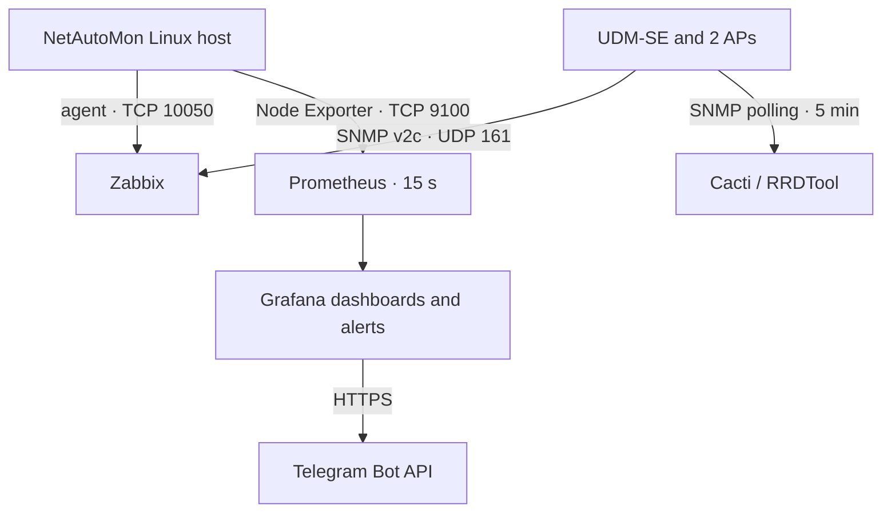

# Monitoring in NetAutoMon

[Back to the main README](../README.md) · [Architecture](architecture.md)

Monitoring was the part of NetAutoMon where I most clearly saw the difference between knowing that a host answers a ping and knowing whether the service people need is actually healthy.

I initially approached it as a networking problem: discover the devices, check reachability and graph interface traffic. Once the lab grew, that view was not enough. The Ubuntu container could still answer ICMP while Grafana was stopped, a router could be up while one interface behaved badly, and a server could remain reachable while memory or disk usage moved towards a failure.

I used Zabbix, Cacti and Prometheus with Grafana because I wanted to compare those views in the same environment. This was not an attempt to claim deep production experience with four monitoring platforms. It was a student lab where the overlap helped me understand what each tool made easy, what it duplicated and what was still missing.

## What each tool was responsible for

| Tool | Main role in this project | Data source | Interval or scale |
| --- | --- | --- | --- |
| Zabbix 7.0 | General host and device status, metrics and problem detection | Zabbix agent and SNMP v2c | 43 agent metrics on NetAutoMon; 12 SNMP metrics per Ubiquiti device |
| Cacti 1.2 | Historical traffic graphs by UDM-SE interface | SNMP v2c and RRDTool | 21 selected interfaces, polled every five minutes |
| Prometheus | Linux time-series collection | Node Exporter | Scrape every 15 seconds |
| Grafana | Current Linux dashboards and RAM alert evaluation | Prometheus | Dashboard with more than 20 panels; alert evaluated every minute |
| Telegram | Delivery channel for Grafana notifications | Telegram Bot API | Triggered by Grafana Alerting or its manual contact-point test |

The tools were not connected into one universal data store. Zabbix and Cacti collected their own data, while Grafana read the Prometheus data source. That distinction is important because seeing a UDM-SE interface in Cacti did not mean it was also present in Grafana.

## Zabbix: the general status view

Zabbix was the broadest monitoring platform in the lab. I added the NetAutoMon host through the Zabbix agent and the Ubiquiti UDM-SE plus two access points through SNMP v2c.

The NetAutoMon host exposed 43 agent metrics. The UDM-SE and each access point exposed 12 SNMP metrics in the configuration I used. This gave me one place to check whether the monitored systems were available and to inspect host or device data without connecting to each one individually.

The installation also produced one of the less glamorous troubleshooting moments in the project. The first Zabbix version I tried did not fit cleanly with Ubuntu 24.04. I moved to Zabbix 7.0, which had official support for that Ubuntu release, and adjusted the MySQL authentication used by the lab installation. The result worked, although the database setup in `setup.sh` remains lab-oriented and will be changed before the script is treated as reusable.

Zabbix also provided the detection side of the Grafana failure demonstration. Stopping `grafana-server` created a service problem that Zabbix detected in under a minute. I then ran the Ansible service playbook manually and Zabbix confirmed that the service had returned. The monitoring event and the recovery action were separate; Zabbix did not automatically launch Ansible. The full sequence is documented in [Failure and Recovery](failure-recovery.md).

## Cacti: interface history

Cacti had a narrower purpose. It queried the UDM-SE through SNMP every five minutes and used RRDTool to keep traffic graphs for 21 selected interfaces.

Those interfaces included physical ports, the WireGuard tunnel and VLAN bridge interfaces such as `br0`, `br14`, `br18`, `br19` and `br20`. I could move backwards through the graphs instead of only looking at what the interface was doing at that moment.

This was where Cacti felt different from Zabbix. Zabbix gave me the more complete operational view; Cacti made it straightforward to focus on long-running interface traffic. The repository does not currently contain a surviving Cacti screenshot, so I am documenting the configuration and purpose without presenting recreated evidence as an original result.

## Prometheus and Grafana: current Linux behaviour

Node Exporter exposed Linux system metrics on port `9100`. Prometheus scraped them every 15 seconds and stored the time series. Grafana then used Prometheus as its data source.

I used the Node Exporter Full dashboard, ID 1860, rather than building every panel from zero. It provided more than 20 panels covering CPU, RAM, disk, network traffic, IOPS, uptime and related Linux metrics.

Using a community dashboard saved time, but I still had to understand the path behind it:

1. Node Exporter had to expose the metrics.
2. Prometheus had to reach and scrape the exporter.
3. Grafana needed a working Prometheus data source.
4. The dashboard queries had to return data for the correct host and time range.

That sequence became useful when a panel was empty. Instead of treating Grafana as the whole monitoring system, I could check each stage separately.

Grafana only visualised Linux metrics in this version. Network data from the UDM-SE stayed in Zabbix and Cacti. Adding Prometheus SNMP Exporter would be one way to bring router interface metrics into the same Grafana view, but it was not implemented in the submitted project.

## RAM alert and Telegram

The Grafana rule was designed around RAM usage above 85 percent and evaluated once per minute. The project documentation also included a repeatable test using `stress` to allocate memory temporarily. However, the Telegram screenshot retained in this repository was produced with Grafana's manual **Test** action for the contact point.

This explains the apparently contradictory text in the notification: the message shows `RAM 0.0%` while describing a threshold above 85 percent. Grafana generated a test payload to verify the delivery route; it was not evidence of a real RAM threshold breach.

The useful result of that test was narrower and still important: Grafana could reach the Telegram Bot API and the configured chat could receive a notification.

The first message templates did not work. Formatting, emojis and special characters caused HTTP 400 responses from the Telegram API. I removed the decoration, reduced the message to plain text and tested the contact point again. That was a small issue, but it reinforced a troubleshooting pattern I want to keep: make the failing integration as simple as possible, prove the complete path and only then add complexity.

The notification path was:

The bot token and chat-specific configuration are secrets and do not belong in the public repository.

## What was actually monitored

The retained project evidence supports the following scope:

- Linux health and resource metrics from the NetAutoMon container;
- availability and agent metrics for the NetAutoMon host in Zabbix;
- SNMP metrics from the UDM-SE and two Ubiquiti access points;
- historical graphs for selected UDM-SE interfaces in Cacti;
- current Linux dashboards in Grafana; and
- the Grafana-to-Telegram notification route.

The Grandstream phones, CCTV camera, Asterisk containers and Pi-hole host appeared in the wider device inventory or architecture, but that does not mean that NetAutoMon collected detailed metrics from all of them. Some were reachability targets only.

## Gaps and failure modes

The monitoring stack worked as a lab, but several gaps became clear:

- Zabbix, Cacti, Prometheus and Grafana ran inside the same LXC they helped observe. A complete container failure could remove both the monitored services and much of the monitoring view.
- There was no small external probe to report that the whole NetAutoMon container had disappeared.
- SNMP v2c was acceptable for the isolated lab but should be replaced by SNMPv3 where supported.
- Dashboards, alert definitions and monitoring configuration were not exported and versioned as code.
- Zabbix and Cacti databases and historical data were not included in the Git repository.
- No central log platform was implemented, so metrics and service state could not be correlated with logs in one place.
- The project did not measure alert noise, false positives or long-term retention under production load.

The RAID incident made the configuration gap concrete. Git preserved code and documentation, but losing the container also meant losing monitoring history and application state. A future version needs tested database backups and exported configuration before it needs another dashboard.

## What I learned from the monitoring design

The biggest lesson was that monitoring is a chain, not a screen. A graph in Grafana depends on an exporter, a collector, stored data and a working query. A Telegram notification depends on the rule, contact point, API and destination. A service being reachable does not prove that it is useful, and monitoring a server from inside the same server does not protect against every failure.

I also learned that adding tools only makes sense if each one answers a question. In NetAutoMon, Zabbix answered the broad host-and-device question, Cacti kept interface history, and Prometheus with Grafana showed current Linux behaviour. The next useful work is to make their configuration recoverable and test the monitoring system's own failure modes, not to add a fifth dashboard.

---

[Back to the main README](../README.md) · [Architecture](architecture.md) · [Automation](automation.md) · [Failure and Recovery](failure-recovery.md)
